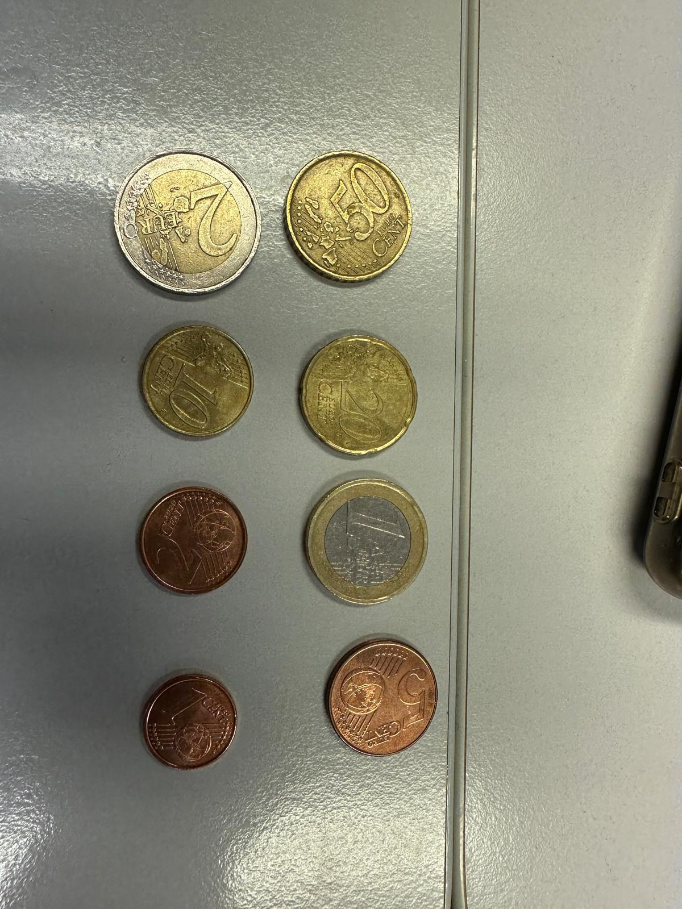

Estas tareas han sido realizadas de manera conjunta por ambos miembros del grupo 23 ([David Marrero Sosa](https://github.com/deivinot) y [Hugo Hernández Morales](https://github.com/HugoHdez)).

# Práctica 3. Detección y reconocimiento de formas.

## **Tarea 1:** Detección de monedas y demostración interactica.

En esta tarea, hemos capturado la siguiente imagen para la detección de monedas, que presenta una ligera sombra que supondrá un reto para el cálculo del borde circular de las mismas y su clasificación.

_Monedas capturadas en el aula de prácticas_

En primer lugar, para poder diferenciar las características de cada moneda, es necesario obtener diferentes parámetros sobre las mismas, como es su diámetro. Además, almacenamos su valor para proceder con la suma de las monedas detectadas en el programa interactivo realizado, que se explicará con posterioridad.

A continuación, cargamos la imagen y aplicaremos suavizados mediante las funciones **_medianBlur()_**, que usaremos en la detección de círculos mediante la transformada de Hough y **_GaussianBlur()_** para la detección de bordes con **_Canny()_**. Para transformada de Hough emplearemos la función **_HoughCircles()_** de OpenCV.

Procesamos los circulos detectados en la imagen, en la que dibujamos la misma detección en color verde y almacenaremos sus características (posición en coordenadas y radio).

Luego, creamos la función **seleccion_moneda()**, que identifica la moneda correspondiente en función de las coordenadas en que hagamos click de la imagen de las mismas. Asumimos que la primera moneda que se toma de referencia es la de un euro, y a partir de ahí, establecemos la escala píxel/mm (con las dimensiones de la misma) y calculamos el valor de las monedas clickadas en función de su dimesión en escala.

Para esto último, con la función **asignar_valor()**, nos encargamos de, como su nombre indica, asignar el valor a la moneda dependiendo de su diametro en milímetros, con una tolerancia de ±2mm. Para finalizar, calcularemos el valor de las monedas detectadas en la imagen, accediendo al valor del diccionario y sumando el total.

## **Tarea 2:** Desarrollo de clasificador basado en heurísticas geométricas y de apariencia de diferentes tipos de partículas.

En esta tarea, hemos tenido como base de la clasificación, tres imágenes, que se corresponden con las siguientes. 

Para comenzar con esta parte, hemos hecho un recorte de las imágenes con el fin de abarcar y analizar sólo el ROI (Región de Interés), y evitar complicaciones con las sombras que presentan las imágenes en la esquina inferior derecha. Luego de esto, hemos aplicado suavizado con la función de OpenCV **_GaussianBlur()_**, con diferentes máscaras. La más grande, para la imagen de fragmentos plásticos, con el fin de garantizar la no detección de ruido en el umbralizado, ya que detecta bordes muy finos que nos dificulta la labor a la hora de contar y clasificar el número de partículas. Para las otras dos restantes hemos aplicado un suavizado menor, ya que la imagen tienen menor dificultad en cuanto la detección de las formas de las partículas (pellets y alquitrán).

En segundo lugar, usamos las imágenes suavizadas para la umbralización binaria de las mismas con la función **_threshold()_** que, tras un proceso de prueba y error de los diferentes parámetros de umbral, hemos conseguido las tres imágenes de las partículas con un ruido controlado, sobretodo y más crítico, en la imagen de los fragmentos plásticos. Como podemos observar, mostramos el resultado invertido, es decir, fondo negro con las partículas detectadas en blanco.

_Umbralizado de las tres imágenes de partículas._

A continuación, creamos la función **_contar_particulas()_**, cuya función es, como bien describe su propio nombre, el conteo de partículas de una imagen dada. Para esto, apoyándonos en la función findContours(), obtenemos el número de contornos cerrados encontrados en la imágen, es decir, que devuelve un set del número de partículas detectadas. Recorreremos esta lista para analizar cada una de las partículas y aplicar las heurísticas necesarias para su clasificación.

En primer lugar, usaremos la función **_boundingRect()_**, que dibuja un rectángulo conteniendo la partícula, que usaremos para ver cuán cuadrado es el perímetro que la contiene. Así podemos determinar su circularidad ayudádonos de **_isclose()_** de NumPy, cuyos parámetros serán 1 (relación ancho-alto perfecta, lo que conlleva a circularidad de la partícula) en cuanto a cercanía de valor, y una tolerancia de 1. 

En segundo lugar, calcularemos el área y el perímetro de los contornos detectados con **_boundingRect()_** y **_arcLength()_**, respectivamente. Estos parámetros nos ayudarán a calcular la circularidad de la partícula (en diferente forma que como se explica en el párrafo anterior) y la relación del área respecto al ancho y alto del rectángulo que contiene el fragmento detectado. Además, también nos ayudará a calcula la compacidad, que se traduce como la relación del cuadrado del perímetro respecto al área. 

En tercer lugar, contendremos también las partículas con una elipse, haciendo uso de **_fitEllipse()_**, y obtendremos también parámetros que nos ayudarán a la clasificación por estructura o forma de las mismas, como la relación entre ejes X e Y de la propia elipse.

Todos estos parámetros se contendrán en listas que nos servirán para clasificar los fragmentos encontrados de cada una de las imágenes. Para la clasificación de los tipos de partículas dependiendo de su forma es la siguiente:
- Primero, si su compacidad es cero (area=0 ó perímetro=0), descartamos la partícula o contorno, ya que se tratará, en la mayoría de los casos, de una falsa detección por ruido en la imagen umbralizada. 
- Si su compacidad es menos de 15 y tiene una buena circularidad (tanto con la función isclose() como con la circularidad calculada como _circularidad = 4 * np.pi * (area / (perimetro ** 2))_), la consideramos como pellet, por su parecido a la forma vista en estas partículas, que tienden a tener forma redonda.
- Si la relación del área con el ancho y alto del contenedor es menor o igua que 0.65 y la relación entre elipses es de 0.78, contamos la partícula como fragmento plástico, debido a sus formas poligonales.
- Si no se da ninguno de estos dos casos, consideramos que es alquitrán, ya que presentan las formas más irregulares e impredecibles debido a su naturaleza. 

Para finalizar, realizaremos la matriz de confusión, cuyas diagonales representan los verdaderos positivos y, el resto, falsos positivos, que variarán dependiendo de la precisión de los cálculos explicados con anterioridad.

  
_Resultados de nuestra matriz de convolución._

Vemos como encontramos un mayor _match_ de las formas en los fragmentos y los pellets, desviándose más del resultado idóneo en el alquitrán.
