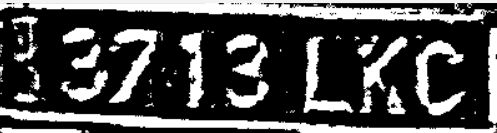

Estas tareas han sido realizadas de manera conjunta por ambos miembros del grupo 23 ([David Marrero Sosa](https://github.com/deivinot) y [Hugo Hernández Morales](https://github.com/HugoHdez)).

# Práctica 4. Reconocimiento de matrículas

En esta práctica se aborda el uso de modelos existentes para la detección de objetos y reconocimiento de texto. Para ello usamos el modelo yolo11n ya entrenado para la detección de objetos, unicamente tomando las clase persona y algunos vehiculos con matrículas (coches, motos, guaguas). Además usamos un modelo que entrenamos para que detecte matrículas y tambien un reconocedor de texto, el tesseract.

## **Paso 1:** Entrenar un modelo para que detecte matrículas.

En este paso, hemos buscado un dataset ya completado de imagenes con matrículas y sus respectivos labels (que indican donde estan las matrículas). Además hemos implementado un script para seleccionar aleatoriamente las muestras que formarán parte del test, del entrenamiento y de la validación, que serán 20%, 72% y 8% del total respectivamente. En dicho script, borramos los directorios si hay creados (por si se quiere volver a mezclar la muestra), a continuación, creamos los directorios de imagenes y labels separadas en las tres etapatas y tras obtener las imagenes y el tamaño de cada subconjunto se añaden las imagenes en sus respectivas carpetas. Finalmente, hacemos lo mismo con las labels pero convirtiendo los xml (que es como venían en el dataset) a archivos de texto con formato YOLO, esto lo hacemos cogiendo la informacion del archivo xml que necesitemos:"width", "height", "xmin", "xmax", "ymin", "ymax".

Lo siguiente que hacemos es entrenar el modelo con el archivo yaml que hace referencia a los directorios creados anteriormente, hemos entrenado el modelo 100 epocas, con un total de 416 imagenes y con agrupaciones de 8 en 8. Y seguidamente hacemos la validación del modelo.

*Matriz de confusión del entrenamiento*

*Matriz de confusión de la validación*

## **Paso 2:** Hacer uso de ambos modelos de detección y el reconocedor de texto para videos.

Este código procesa un video para detectar personas, vehículos y matrículas, combinando los modelos de detección comentados anteriormente con el OCR (reconocedor de texto) para identificar el texto de las matrículas. Utiliza la biblioteca OpenCV para la manipulación de video y pytesseract para el reconocimiento de texto en imágenes.

Primero definimos dos funciones auxiliares, *draw_rectangle()*, que dibuja un rectángulo en torno al objeto detectado y añade una etiqueta con la clase del mismo, y *is_valid_plate()*, que valida si el texto detectado en la matrícula (se explicará como posteriormente), mediante el uso de expresiones regulares con *RegEx*, cumple con el formato de matrícula española. No obstante, al no obtener un resultado aceptable ya que la gran mayoría de resultados se descartaban por una detección incorrecta, aceptamos cualquier combinación de que contenga letras, números y espacios en blanco.

Para la detección, hacemos un bucle en el que vaya haciendo la deteccion de yolo11n en cada frame y cuando encuentre un objeto que sea un vehículo, recortamos ese vehículo para usar esa región de interés (ROI) y le haga su respectiva detección de matrícula. Las características de cada detección se van guardando un archivo CSV, como el tipo de objeto, la confianza, las coordenadas y el texto de la matrícula, si es aplicable.

Por su parte, si se identifica una matrícula en la ROI, y se aplica un preprocesamiento para mejorar la calidad de la imagen, convirtiéndola a escala de grises y aplicando un umbralizado adaptativo que facilita el reconocimiento del texto con *pytesseract*. Luego, se extrae el texto de la matrícula y se verifica si cumple con el formato de matrícula con la función *is_valid()*, mencionada con anterioridad. Además, mostramos la imagen de las matrículas con su procesamiento en la ejecución. Un ejemplo de cómo se pasa la imagen de la matrícula al OCR lo podemos observar en la siguiente imagen:

Después se dibujan sobre el video los resultados de las deteccionese, destacando cada detección con un rectángulo de un color específico.

Por último, el video procesado y los datos de detección en formato CSV se guardan. Al finalizar, el código muestra el conteo total de personas, vehículos y matrículas detectadas en el video, y libera los recursos.

Enlaces a los videos de entrada y salida:

Entrada:
https://alumnosulpgc-my.sharepoint.com/personal/hugo_hernandez103_alu_ulpgc_es/_layouts/15/stream.aspx?id=%2Fpersonal%2Fhugo%5Fhernandez103%5Falu%5Fulpgc%5Fes%2FDocuments%2FVC%5FP4%2Fvideo%5Fentrada%5Fcrop%2Emp4&referrer=StreamWebApp%2EWeb&referrerScenario=AddressBarCopied%2Eview%2Efeddd6be%2D15b8%2D4744%2D9415%2Dc57d7f519de6

Salida:
https://alumnosulpgc-my.sharepoint.com/personal/hugo_hernandez103_alu_ulpgc_es/_layouts/15/stream.aspx?id=%2Fpersonal%2Fhugo%5Fhernandez103%5Falu%5Fulpgc%5Fes%2FDocuments%2FVC%5FP4%2Fvideo%5Fsalida%2Emp4&referrer=StreamWebApp%2EWeb&referrerScenario=AddressBarCopied%2Eview%2E7c52ffab%2D0e53%2D49da%2D91d1%2D2d6d4d8e63c0&mode=Edit

